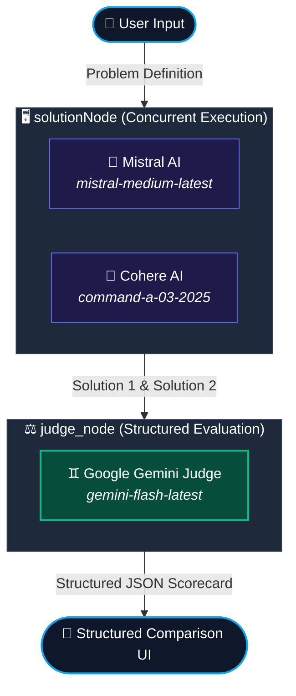

# 🤖 Arenix

Arenix is an advanced, real-time multi-model AI evaluation platform. It utilizes agentic workflows powered by **LangChain** and **LangGraph** to concurrently query multiple LLM providers, analyze their responses, and leverage an AI judge node to grade, compare, and summarize the solutions side-by-side.

---

## 📐 System Workflow & Architecture

Arenix uses a centralized graph structure to orchestrate parallel agent execution and state management.



---

## ⚡ Key Features

* **Multi-Model Orchestration**: Leverages `@langchain/langgraph` to structure sequential/parallel workflow nodes cleanly.
* **Autonomous AI Evaluation**: Utilizes `gemini-flash-latest` with a Zod validation schema to score inputs and justify ratings.
* **True Concurrency**: Executes independent model pipelines simultaneously using `Promise.allSettled` to optimize response times.
* **Elegant UI Shell**: Built on React 19, Vite 7, and Tailwind CSS v4 featuring micro-animations, glassmorphism, response card layouts, markdown rendering, and syntax highlighting.
* **Theme Agnostic**: Offers a fluid Dark/Light mode interface utilizing React Context.
* **Resilient Architecture**: Fallbacks gracefully in the event of API rate limits (429 errors) or server issues.

---

## 🛠️ Tech Stack

### Backend
* **Runtime & Language**: Node.js, TypeScript, ESM (`tsx`)
* **Framework**: Express.js (v5)
* **Agentic Framework**: `@langchain/langgraph`, `@langchain/core`
* **Model Connectors**: `@langchain/google`, `@langchain/mistralai`, `@langchain/cohere`
* **Validation**: Zod (Structured outputs)

### Frontend
* **Core Framework**: React 19, Vite 7
* **Styling**: Tailwind CSS v4, CSS Variables
* **Icons**: `lucide-react`
* **Formatting**: `react-markdown` (HTML translation), `react-syntax-highlighter` (code codeblocks)

---

## 📁 Repository Structure

```directory
Arenix/
├── Backend/                 # Express & LangGraph Server
│   ├── src/
│   │   ├── ai/
│   │   │   ├── graph.ai.ts  # LangGraph structure & solution/judge nodes
│   │   │   └── model.ai.ts  # Model setups (Gemini, Mistral, Cohere)
│   │   ├── config/          # Configurations & env loaders
│   │   └── app.ts           # Express routing & middleware
│   ├── server.ts            # Entrypoint (Port 3000)
│   └── tsconfig.json        # TypeScript configuration
├── Frontend/                # Vite & React Client
│   ├── src/
│   │   ├── app/
│   │   │   ├── components/  # MessageThread, ChatInput UI elements
│   │   │   ├── context/     # ThemeContext (Dark/Light Mode)
│   │   │   ├── App.jsx      # Main Application Shell
│   │   │   └── App.css      # Core Custom Styles
│   │   └── main.jsx         # Hydration point
│   ├── vite.config.js       # Vite build configurations
│   └── package.json
└── README.md                # General Project Walkthrough
```

---

## ⚙️ Setup & Installation

### 1. Prerequisite API Keys
Arenix queries three cloud LLM models. Create a `.env` file inside the `Backend/` directory and configure the following keys:

```env
GOOGLE_API_KEY="your-google-api-key"
MISTRAL_API_KEY="your-mistral-api-key"
COHERE_API_KEY="your-cohere-api-key"
```

---

### 2. Launch the Backend Server

Open your terminal, navigate to the `Backend` directory, install packages, and boot the TSX watch-server:

```bash
cd Backend
npm install
npm run dev
```
The backend server runs locally on **`http://localhost:3000`**.

#### Primary REST Endpoints:
* **`GET /`**: Executes a health check comparing factorial logic across models.
* **`POST /invoke`**: Receives custom JSON payloads to run the graph pipeline.
  ```json
  {
    "input": "Write an code for Factorial function in js"
  }
  ```

---

### 3. Launch the Frontend Application

Open a second terminal, navigate to the `Frontend` directory, install packages, and launch Vite:

```bash
cd Frontend
npm install
npm run dev
```
The frontend client launches on **`http://localhost:5173`**. Open this link in your browser to experience Arenix!

---

## 🛡️ Robust Error Handling

The application is built defensively to capture rate-limiting issues or missing configuration setups. 

* **Model Rate Limits**: If Mistral AI or Cohere AI returns a `429` error, the graph returns a descriptive error state to the UI without crashing the process.
* **Judge Reliability**: If the Gemini Judge Agent fails, the backend captures the error safely, scoring both models `0` and giving clear technical logs to help debug API credentials.

---

## 🚀 Monolithic Production Deployment (Render)

For optimal load-speeds and free-tier efficiency, Arenix is configured to compile as a **monolith** where the Express backend serves the pre-compiled static React frontend. This means you only need to host **one** Render Web Service instead of split environments.

### Step-by-Step Render Setup

1. **Push to GitHub**: Make sure all your local changes (including production updates) are committed and pushed to your GitHub repository.
2. **Create New Web Service**:
   * Log into your [Render Dashboard](https://dashboard.render.com/).
   * Click **New +** and select **Web Service**.
   * Connect your GitHub repository.
3. **Configure Settings**:
   * **Name**: `arenix`
   * **Language/Runtime**: `Node`
   * **Root Directory**: `(Leave empty)` (This must be the repository root to allow build access to both Backend and Frontend folders)
   * **Build Command**:
     ```bash
     npm install --prefix Backend && npm run build --prefix Backend && npm install --prefix Frontend && npm run build --prefix Frontend
     ```
   * **Start Command**:
     ```bash
     npm start --prefix Backend
     ```
   * **Instance Type**: `Free`
4. **Define Environment Variables**:
   Under the **Environment** tab, add the following variables:
   * `NODE_ENV`: `production` (Triggers static serving in Express)
   * `GOOGLE_API_KEY`: `your_gemini_api_key`
   * `MISTRAL_API_KEY`: `your_mistral_api_key`
   * `COHERE_API_KEY`: `your_cohere_api_key`

Click **Deploy Web Service**. Render will automatically build the React assets, compile your TypeScript server, bundle them together, and deploy them under a single HTTPS-secured domain (e.g., `https://arenix.onrender.com`).
